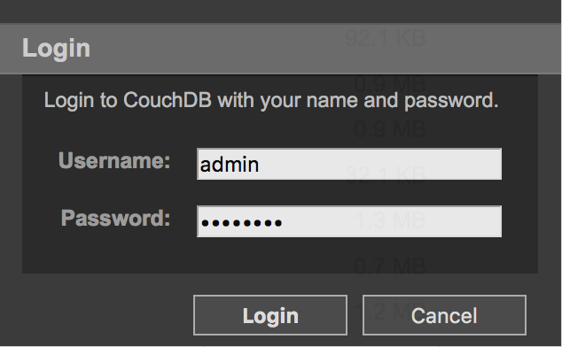

# How To Migrate from Iris Couch to IBM Cloudant

Both IBM Cloudant and Iris Couch are compatible with the open source Apache CouchDB&trade; database, and so they are compatible with each other. That's great news! It means that you can easily migrate from Iris Couch to Cloudant with a minimum of troubles, using your web browser.

This document will walk through the process of migrating your data from Iris Couch to Cloudant. Here is the migration plan:

1. Create a free IBM Cloudant account
1. Use replication to move your data from Iris Couch to Cloudant
1. Transfer optional hosting configurations: CORS and virtual hosts
1. Make some databases public
1. Update your application

Both Cloudant and Iris Couch are compatible (and based on) Apache CouchDB, and CouchDB excels at replication. Thus, Iris Couch is a convenient migration platform &mdash; both to it, and from it. Most people can completely migrate in an hour or so.

Indeed, Iris Couch has a very helpful blog post, [How-To: Bail out on Iris Couch][iris-bail]. That walkthough is great for moving to Apache CouchDB; however, this document will focus specifically on Cloudant, a quicker and simpler task. So let's begin!

## Preparation

In this document, we will use the example, *example.cloudant.com* and *example.iriscouch.com*, but of course your account will be your own, with your own user name prefixed before the `.cloudant.com` and `.iriscouch.com` domain. In all cases, substitute your own account's URL instead of *example.cloudant.com* and *example.iriscouch.com*.

Before you begin this migration, you will need to know:

1. Your **Iris Couch URL**, for example, *example.iriscouch.com*
1. Your Iris Couch **admin username and password**. You can confirm these by following the procedure in *Step 2* below. If you've forgotten it, you can [reset your Iris Couch admin password][iris-reset].

## Step 1: Create a Free IBM Cloudant Account

Like Iris Couch, IBM Cloudant has a free tier! [Sign up for a free Cloudant account][sign-up].

Unlike Iris Couch, [Cloudant pricing](https://cloudant.com/product/pricing/) breaks down differently, but it's easy to stay within the free tier for smaller projects. For larger projects, Cloudant sells dedicated instances and manages them 24/7. I won't go into details here, but know that Cloudant offers different deployment models for heavier usage. (See their [product comparison](https://cloudant.com/product-options/) for more.)

Once you have signed up, [sign in][sign-in].

## Step 2: Sign in to your Iris Couch account

To sign into Iris Couch as the admin:

  1. Go to Futon: *https://example.iriscouch.com:6984/_utils/*
  1. Click the *Login* link in the lower-right:

    

  1. Input your admin username and password in the prompt:

    

  1. You can confirm that you logged in successfully by looking at the label in the lower-right of Futon. It will say, "Welcome"

    

## Step 3: Replicate Databases

Now we reach the heart of this whole exercise: transferring databases from Iris Couch to Cloudant.

Of course, we will use replication to move the data; but what exactly is the procedure? We have a myriad of decisions to make. Replication can be done synchronously ("replicate, and tell me when you are finished") or asynchronously ("replicate quietly in the background"); either as a one-off, or continuously; either pushing or pulling; and, finally, either initiated from Iris Couch or from Cloudant. And what about automating the process?

Since this is a one-time undertaking, let's keep it simple:

* Stick to clicking and typing in the web interface; let's not worry about automation
* Work primarily in the Cloudant dashboard
* Simple, one-off replication. Let's not worry about continuous replication. (Advanced users who need this can simply follow this procedure and check that box on the form).

A note on continuous replication in Cloudant:
> **Note:** Continuous replication jobs are helpful while initially migrating your data, but creating lots of ongoing, continuous replications *can* result in charges later on that are outside of Cloudant's free usage tier. Be sure to monitor your account usage in the Cloudant dashboard if you decide to make heavy use of continuous data replication. Their [pricing page](https://cloudant.com/product/pricing/) has more details on the free tier and metered billing rates.

Begin by looking at Futon in Iris Couch. You should see a list of your databases. Keep this list handy.

**For each database in Iris Couch**, (in this example, a database named *foo*) do the following in the Cloudant dashboard.

1. In the Cloudant dashboard, click the *Replication* tab, which should take you to *https://example.cloudant.com/dashboard.html#/replication*
1. Click *New Replication* and fill out the form:
  1. For *_id*, enter *iriscouch-* followed by the database name. For example, enter *iriscouch-foo*. This will help you to see the replication status at a glance
  1. For *Source Database*, click *Remote Database* and enter the URL of the format https://**iriscouch-admin**:**iriscouch-password**@*example.iriscouch.com*/*foo*. That is, input your iris couch admin username, password, URL, and this database name, for example, *foo*). You can copy this full URL, so that next time, you can paste it and simply change the final database name.
  1. For *Target Database*, click *New Database*, then click *Local*, and then input the database name, *foo*
  1. **Do not** check *Make this replication continuous*
1. Click the *Replicate* button. The dashboard will prompt you for your Cloudant password; so input it and click *Continue Replication*

You will see the button label change to *Starting replication*, and shortly you will bounce to the *All Replications* tab. Stop to admire your new replication underway! If you click the document ID, you can see internal details about the replication, such as how much it has copied, and how many documents remain. After a while, the replication status will become *Triggered*, and finally *Completed*.

Continue this step for every database listed in Futon on Iris Couch. Feel free to run multiple replications at the same time. Each is an independent process. They will not interfere with each other.

Once you have initiated replication for all databasess, wait for all of their statuses to be *Completed*.  That's it! The hard part is done!

## Step 4: Transfer CORS and virtual host configuration

The vast majority of Iris Couch users do not use virtual hosting ("vhosts") or CORS. In both cases, these are advanced features for special-purpose applications; so if you are not familiar with virtual hosting or CORS on Iris Couch or Cloudant, then you can safely skip this step.

On Iris Couch, you can see both vhosts and CORS settings in the *Configuration* tab, on the right-hand side of Futon.

### CORS

Look at your CORS settings in Iris Couch.

Look at the *origins* configuration. You need to transfer this to your Cloudant account.

In the Cloudant dashboard:

**For each virtual host line in Iris Couch**, do the following in the Cloudant dashboard.

1. Click the *Account* tab, which should take you to *https://example.cloudant.com/dashboard.html#/account*
1. Click *CORS* and fill out the form:
  * If your Iris Couch *origins* config is simply `*` (all domains), then select *All Domains* in Cloudant.
  * If your Iris Couch *origins* config is a comma-separated list of domains, then for each domain, paste it in the dashboard prompt and click *Add*

CORS on Cloudant is done!

### Virtual Hosting

Look at your virtual hosts in Iris Couch.

The vhost config has two important columns: the domain to serve, and the path to use for serving that domain (nearly always a "rewrite" path). In the screenshot:

* The hosted domain is *example.com*
* Queries to example.com will be served from the path */example_com/_design/example_com/_rewrite*

**For each virtual host line in Iris Couch**, do the following in the Cloudant dashboard.

1. In the Cloudant dashboard, click the *Account* tab, which should take you to *https://example.cloudant.com/dashboard.html#/account*
1. Click *Virtual Hosts* and fill out the form:
  1. For *Hostname*, copy the hostname from Futon on Iris Couch (such as *example.com*) and paste it here.
  1. For *Path (optional)*, copy the path from Futon on Iris Couch (such as */example_com/_design/example_com/_rewrite*) and paste it here. But **remember to remove the leading slash**, because Cloudant will automatically prepend the slash character.
1. Click *Save*. After a moment, you will see your virtual host entry listed on the dashboard page.

Repeat this procedure for every virtual host you have configured for Iris Couch. That's it! Since you've already replicated your data, the necessary database and design documents are already in place. Be sure to read the next section, since you will very likely want to open the database to the public.

Finally, with the vhosts in place, *test them*. This process is different for each application. But, for example, this is a simple way to test vhosts from the command prompt using the free cURL tool. The command will query Cloudant at the virtual host domain, and it will display the response headers.

    $ curl -I example.cloudant.com -H 'Host: example.com'
    HTTP/1.1 200 OK
    X-Couch-Request-ID: b6b71c1d89
    Vary: Accept
    Server: CouchDB/1.0.2 (Erlang OTP/17)
    Etag: "3B1WJJIVF36CDRTRMYF0NC2DR"
    Date: Tue, 30 Nov 2015 14:48:50 GMT
    Content-Type: text/html; charset=utf-8
    Content-Length: 2563
    X-Content-Type-Options: nosniff;

Your results will vary slightly, but the key thing to note is the *Content-Type* is `text/html` and the *Content-Length* is correct for an HTML web page. Of course, you can omit the `-I` option to view the actual HTML output.

## Optionally Publish a Database

Iris Couch security permissions are slightly different from Cloudant: Iris Couch databases are *publicly readable* by default, but Cloudant databases are private by default. If you have used a vhost, or if you otherwise maintain publicly-accessible databases, you will need to enable that permission on Cloudant.

**To make a Cloudant database publicly visible:**

1. In the Cloudant dashboard, click the *Databases* tab,
1. Click the name of the database
1. Click *Permissions*
1. If you want the *raw database API* accessible publicly, check the box intersecting the column *Reader* and the row *Everybody Else*.
1. If you are publishing an app using vhosts, you will see a **Virtual Hosts** section. Check the *Reader* box for the appropriate domain name.

## Update Your Application

The final step is to update your application to work from Cloudant instead of Iris Couch. Again, this is highly specific for each application; however, the basic idea is to simply replace *iriscouch* with *cloudant*.

Search through your application source code for *iriscouch.com*. Change those to *cloudant.com*.

Finally, check your site domain settings (your *DNS* configuration). If you have CNAME records which reference *iriscouch.com*, change them to *cloudant.com*. This is most common with vhost users.

## Congratulations!

You have migrated!

If you cannot completely migrate in an instant, changes might land on Iris Couch after you have already replicated. In most cases, just re-run the replication process, and you will re-sync your data. But you can also make the replication *continuous*, which will pull in all Iris Couch changes in real time.

You're done! Relax and enjoy.

 
<small><em>&copy; &quot;Apache&quot;, &quot;CouchDB&quot;, &quot;Apache CouchDB&quot;, and the CouchDB logo are trademarks or registered trademarks of The Apache Software Foundation. All other brands and trademarks are the property of their respective owners.</em></small>

[END]: ------------------------------------------------------------------------

[iris-bail]: http://www.iriscouch.com/blog/2011/05/how-to-bail-out-on-iris-couch
[iris-reset]: https://www.iriscouch.com/account/#/couchdb
[sign-in]: https://cloudant.com/sign-in/
[sign-up]: https://cloudant.com/sign-up/
